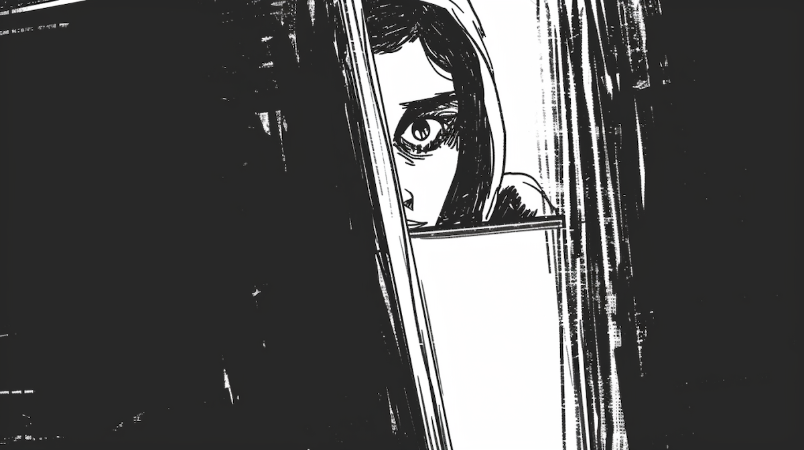

```{r setup, include=FALSE}
usethis::use_git_ignore(c("*.csv", "*.rds"))
options(htmltools.dir.version = FALSE)

library(knitr)
library(tidyverse)
library(xaringan)
library(fontawesome)
```

class: inverse, center, middle

# `r fa("fas fa-images", fill = "#fff")`

**View the slides:** 

[bretsw.com/edf5442-ss24-module8](https://bretsw.com/edf5442-ss24-module8)

---

class: inverse, center, middle

# Standup

```{r, out.width = "100%", echo = FALSE, fig.align = "center"}
include_graphics("img/standup.png")
```


---

class: inverse, center, middle

# `r fa("fas fa-handshake", fill = "#fff")` <br><br> How do you establish and maintain trust in inquiry?

---

# `r fa("fas fa-handshake", fill = "#fff")` Trust in Inquiry

```{r, out.width = "100%", echo = FALSE, fig.align = "center"}

```

### How would you investigate the effects of tweaks to your design?

---

# `r fa("fas fa-handshake", fill = "#fff")` Trust in Inquiry

<p style="text-align: center;"><iframe id="trust_game" title="The Evolution of Trust game" src="https://ncase.me/trust/" width="100%" height="480" data-mce-fragment="1"></iframe></p>

---

# `r fa("fas fa-handshake", fill = "#fff")` Trust in Inquiry

<p style="text-align: center;"><iframe width="100%" height="480" src="https://www.youtube.com/embed/vuMt8b4UrcI?si=gpnIUCEJqGhFjc4H" title="YouTube video player" frameborder="0" allow="accelerometer; autoplay; clipboard-write; encrypted-media; gyroscope; picture-in-picture; web-share" referrerpolicy="strict-origin-when-cross-origin" allowfullscreen></iframe></p>

---

# `r fa("fas fa-handshake", fill = "#fff")` Trust in Inquiry

<p style="text-align: center;"><iframe width="100%" height="480" src="https://www.youtube.com/embed/iXv91xFipLM?si=WMhRJCN-XkXuuexg" title="YouTube video player" frameborder="0" allow="accelerometer; autoplay; clipboard-write; encrypted-media; gyroscope; picture-in-picture; web-share" referrerpolicy="strict-origin-when-cross-origin" allowfullscreen></iframe></p>

---

# `r fa("fas fa-handshake", fill = "#fff")` Trust in Inquiry

```{r, out.width = "560px", echo = FALSE, fig.align = "center"}

```

--

## Facebook

--

- `r fa("fas fa-newspaper", fill = "#782F40")` [Everything We Know About Facebook’s Secret Mood-Manipulation Experiment](https://www.theatlantic.com/technology/archive/2014/06/everything-we-know-about-facebooks-secret-mood-manipulation-experiment/373648/) (Meyer, 2014 in *The Atlantic*)

--

- `r fa("fas fa-newspaper", fill = "#782F40")` [Facebook Angry Emoji Algorithm](https://www.washingtonpost.com/technology/2021/10/26/facebook-angry-emoji-algorithm/) (Oremus, 2021 in *The Washington Post*)

---

# `r fa("fas fa-handshake", fill = "#fff")` Trust in Inquiry

```{r, out.width = "560px", echo = FALSE, fig.align = "center"}

```

## Instagram

- `r fa("fas fa-newspaper", fill = "#782F40")` [Appearance-based Social Comparison on Instagram](https://s.wsj.net/public/resources/documents/appearance-based-social-comparison-on-instagram.pdf) (2021 in *The Wall Street Jounral*)

--

- `r fa("fas fa-newspaper", fill = "#782F40")` [Instagram Use and Body Dissatisfaction: The Mediating Role of Upward Social Comparison with Peers and Influencers among Young Females](https://www.ncbi.nlm.nih.gov/pmc/articles/PMC8834897/) (Pedalino & Camerini, 2022 in *International Journal of Environmental Research and Public Health*)

---

class: inverse, center, middle

# Sorting

```{r, out.width = "100%", echo = FALSE, fig.align = "center"}
include_graphics("img/plinko.png")
```

---

class: inverse, center, middle

# Scrum Teams

```{r, out.width = "100%", echo = FALSE, fig.align = "center"}
include_graphics("img/scrum.png")
```

### `r fa("fas fa-comments", fill = "#fff")` What are some ethical principles we can learn from these examples?


---

class: inverse, center, middle

# `r fa("fas fa-handshake", fill = "#fff")` <br><br> Ethical Principles

---

# `r fa("fas fa-handshake", fill = "#fff")` Ethical Principles

```{r, out.width = "600px", echo = FALSE, fig.align = "center"}

```

### Participant-Centered

--

- Build rapport

--

- Check in regularly

--

- **Do no harm**

---

# `r fa("fas fa-handshake", fill = "#fff")` Ethical Principles

```{r, out.width = "600px", echo = FALSE, fig.align = "center"}

```

### Navigate Bias with Open Eyes

--

- Self-reflection (research positionality)

--

- Experiments, self-reports, observations, naturalisti/unobtrusive

--

- **Universal design** (`r fa("fas fa-book-open-reader", fill = "#782F40")` Salkind & Frey, 2023, Ch. 15)


---

class: inverse, center, middle

# `r fa("fas fa-rss", fill = "#fff")` <br><br> Reporting Principles

---

# `r fa("fas fa-rss", fill = "#fff")` Reporting Principles

```{r, out.width = "420px", echo = FALSE, fig.align = "center"}

```

### Know your audience (`r fa("fas fa-book-open-reader", fill = "#782F40")` O'Leary, 2005, pp. 273-274)

--

- Who are we writing for?

--

- What do they know?

--

- What will they find most useful?

--

- What are their expectations?

--

- How might they react?

---

# `r fa("fas fa-rss", fill = "#fff")` Reporting Principles

```{r, out.width = "420px", echo = FALSE, fig.align = "center"}

```

### Own your purpose (`r fa("fas fa-book-open-reader", fill = "#782F40")` O'Leary, 2005, pp. 272-273)

--

- Recommendations and actions plans

--

- Procedures, protocols, guidelines, programs, tools, and kits

--

- Prototypes and models

--

- Policy development

--

- Education/awareness materials


---

# `r fa("fas fa-rss", fill = "#fff")` Reporting Principles

```{r, out.width = "420px", echo = FALSE, fig.align = "center"}

```

### Pick your style (`r fa("fas fa-book-open-reader", fill = "#782F40")` O'Leary, 2005, pp. 276-280)

--

- **Academic style:** problem, background, purpose, method, results, implications

--

- **Chronology:** how things unfolded during the project

--

- **Theory-building:** narrative of how theory was inductively generated

--

- **Findings first:** put conclusions up front then describe path to get there


---

class: inverse, center, middle

# Project Teams

```{r, out.width = "100%", echo = FALSE, fig.align = "center"}
include_graphics("img/scrum.png")
```

**Work on survey reflection and final report...**


---

class: inverse, center, middle

# Standup

```{r, out.width = "100%", echo = FALSE, fig.align = "center"}
include_graphics("img/standup.png")
```

---

class: inverse, center, middle

# `r fa("fas fa-binoculars", fill = "#fff")` <br><br> Looking ahead

---

# `r fa("fas fa-calendar-day", fill = "#fff")` Semester Schedule

```{r, out.width = "360px", echo = FALSE, fig.align = "center"}
include_graphics("img/across-time.jpg")
```

- ~~Module 1: Introduction to Inquiry~~

- ~~Module 2: Reviewing the Literature~~

- ~~Module 3: Planning for Inquiry~~

- ~~Module 4: Measurement: Surveys & Tests~~

- ~~Module 5: Measurement: Interviews~~

- ~~Module 6: Analysis: Quantitative~~

- ~~Module 7: Analysis: Qualitative~~

- **Module 8: Ethics & Reporting**

---

# `r fa("far fa-keyboard", fill = "#fff")` Major Assignments

```{r, out.width = "240px", echo = FALSE, fig.align = "center"}
include_graphics("img/build.jpg")
```

### Individual Assignments (20%)

- ~~Problem Statement and Annotated Bibliography (10%)~~
- ~~Test Items (10%)~~

### Group Assignments (50%)

- ~~Inquiry Plan** (5%)~~
- ~~Survey Instrument (10%)~~
- ~~Interview Protocol (10%)~~
- **Survey Reflection & Write-up (10%) - due this week**
- **Final Report (15%) - due at end of semester**

### Participation (30%)

- **Weekly Class Activities** (2% each week)

---

class: inverse, center, middle

# `r fa("fas fa-question", fill = "#fff")` <br><br> Questions

<hr>

**What questions can I answer for you now?**

**How can I support you this week?**

<hr>

`r fa("fas fa-envelope", fill = "#fff")` [bret.staudtwillet@fsu.edu](mailto:bret.staudtwillet@fsu.edu) | `r fa("fas fa-globe", fill = "#fff")` [bretsw.com](https://bretsw.com) | `r fa("fab fa-github", fill = "#fff")` [GitHub](https://github.com/bretsw/)